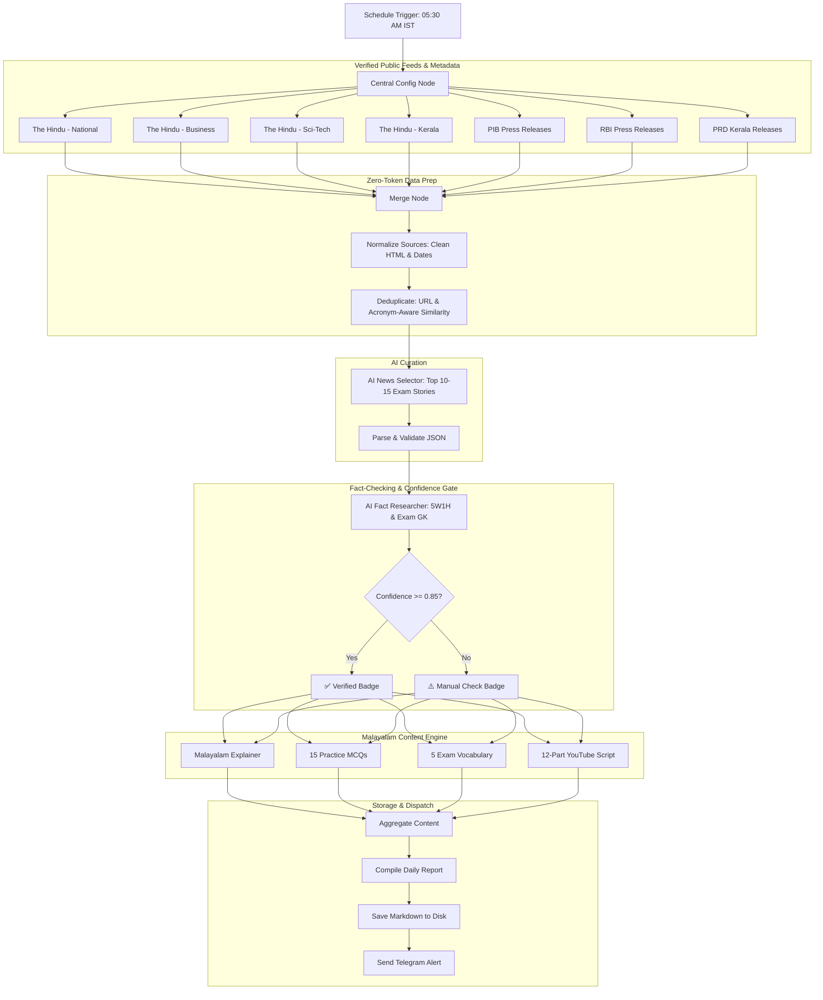

# Daily Current Affairs Automation (The Hindu & Official Sources) — n8n Workflow

A production-ready, modular, and local **n8n automation system** designed for Malayalam competitive examination current affairs (Kerala PSC, SSC, UPSC, and Banking).

---

## 📑 Table of Contents
1. [Architecture & Philosophy](#1-architecture--philosophy)
2. [Prerequisites (Mac Setup)](#2-prerequisites-mac-setup)
3. [Credentials Setup in n8n](#3-credentials-setup-in-n8n)
4. [Importable Workflows](#4-importable-workflows)
5. [Node-by-Node Technical Reference](#5-node-by-node-technical-reference)
6. [AI Prompt Engineering](#6-ai-prompt-engineering)
7. [Inter-Node Data Structures (JSON Schemas)](#7-inter-node-data-structures-json-schemas)
8. [Resilience & Error Handling](#8-resilience--error-handling)
9. [10-Step Staged Testing Procedure](#9-10-step-staged-testing-procedure)
10. [Future Extensions](#10-future-extensions)

---

## 1. Architecture & Philosophy



### Core Tenets:
* **The Hindu as Primary Anchor**: Designed to be manually cross-checked against your daily physical newspaper before recording audio.
* **Strict Source Policy**: Uses only publicly accessible RSS feeds and official metadata. Zero paywall bypass or scraping hacks.
* **Confidence Gate ($\ge 0.85$)**: Low-confidence or unverified items are automatically flagged with `⚠️ [MANUAL VERIFICATION REQUIRED]`.
* **Cost Minimization**: All raw deduplication and source merging happen deterministically in JavaScript before any LLM is called.

---

## 2. Prerequisites (Mac Setup)

### Option A: Running n8n via Node.js / npx (Recommended for macOS)
Since Node.js is already installed on your Mac, you can start n8n instantly in your terminal:
```bash
# Start n8n locally
npx n8n
```
*n8n will start and be accessible at `http://localhost:5678`.*

### Option B: Running n8n via Docker Desktop
If you prefer running n8n containerized:
```bash
docker run -it --rm \
  --name n8n \
  -p 5678:5678 \
  -v ~/.n8n:/home/node/.n8n \
  -v /Users/pious/Documents/personalproject/scrapping/reports:/data/reports \
  docker.n8n.io/n8nio/n8n
```

---

## 3. Credentials Setup in n8n

Open your local n8n interface (`http://localhost:5678`) and navigate to **Credentials** $\rightarrow$ **Add Credential**:

### 1. OpenAI / LLM Model Credential
* **Type**: `OpenAI API` (or Google Gemini / Anthropic / Groq / OpenRouter)
* **API Key**: Enter your API key (`sk-...`).
* **Name**: `OpenAI account` (Used by the AI nodes in the workflow).
* *Note: You can switch model names in the node (e.g. `gpt-4o-mini`, `gpt-4o`, `gemini-1.5-pro`) without changing the workflow structure.*

### 2. Telegram API Credential
* **Type**: `Telegram API`
* **Access Token**: Create a bot in Telegram by messaging `@BotFather` $\rightarrow$ `/newbot` $\rightarrow$ Copy the bot token.
* **Chat ID**: Message `@userinfobot` or `@RawDataBot` on Telegram to get your personal numeric `chat_id`.

---

## 4. Importable Workflows

The following workflow JSONs are located in the `workflows/` directory:

| Workflow File | Purpose | Milestone |
| :--- | :--- | :--- |
| [`milestone1_ingestion_selector.json`](file:///Users/pious/Documents/personalproject/scrapping/workflows/milestone1_ingestion_selector.json) | Ingestion $\rightarrow$ Normalization $\rightarrow$ Deduplication $\rightarrow$ AI News Selection | **Milestone 1** |
| [`milestone2_research_verification.json`](file:///Users/pious/Documents/personalproject/scrapping/workflows/milestone2_research_verification.json) | AI Fact Research $\rightarrow$ Confidence Gate ($\ge 0.85$) $\rightarrow$ Source Preservation | **Milestone 2** |
| [`milestone3_content_generation.json`](file:///Users/pious/Documents/personalproject/scrapping/workflows/milestone3_content_generation.json) | Malayalam Explainer $\rightarrow$ MCQs $\rightarrow$ Vocabulary $\rightarrow$ YouTube Voice-Over Script | **Milestone 3** |
| [`daily_current_affairs_complete.json`](file:///Users/pious/Documents/personalproject/scrapping/workflows/daily_current_affairs_complete.json) | **Complete End-to-End Master Workflow** (Schedule $\rightarrow$ Disk Storage $\rightarrow$ Telegram) | **Master** |

### How to Import into n8n:
1. Open n8n (`http://localhost:5678`).
2. Click **Workflows** $\rightarrow$ **Add Workflow** $\rightarrow$ Click the **`...`** (top right) $\rightarrow$ **Import from File**.
3. Select any of the JSON files above.
4. Connect your OpenAI and Telegram credentials.

---

## 5. Node-by-Node Technical Reference

Below is the complete reference for every node in the Master Workflow:

### 1. `Schedule Trigger (05:30 AM IST)`
* **Type**: `n8n-nodes-base.scheduleTrigger` (v1.2)
* **Purpose**: Triggers execution daily at 05:30 AM Indian Standard Time.
* **Cron Expression**: `30 5 * * *`

### 2. `Central Configuration`
* **Type**: `n8n-nodes-base.set` (v3.4)
* **Purpose**: Single source of truth for global configuration parameters.
* **Assignments**:
  * `language`: `"Malayalam"`
  * `primary_source`: `"The Hindu"`
  * `target_exams`: `"Kerala PSC, SSC, UPSC, Banking"`
  * `daily_story_count`: `12`
  * `timezone`: `"Asia/Kolkata"`
  * `minimum_confidence`: `0.85`
  * `report_dir`: `"/Users/pious/Documents/personalproject/scrapping/reports"`

### 3–9. `Source Ingestion Nodes (The Hindu, PIB, RBI, PRD Kerala)`
* **Type**: `n8n-nodes-base.rssFeedRead` (v1.1)
* **Settings**: `continueOnFail: true` (Prevents entire workflow halt if one feed is down).
* **Endpoints**:
  * The Hindu National: `https://www.thehindu.com/news/national/feeder/default.rss`
  * The Hindu Business: `https://www.thehindu.com/business/feeder/default.rss`
  * The Hindu Sci-Tech: `https://www.thehindu.com/sci-tech/feeder/default.rss`
  * The Hindu Kerala: `https://www.thehindu.com/news/national/kerala/feeder/default.rss`
  * PIB Press Releases: `https://pib.gov.in/RssMain.aspx?ModId=6&LangId=1` *(with User-Agent)*
  * RBI Press Releases: `https://www.rbi.org.in/pressreleases_rss.xml` *(with User-Agent)*
  * PRD Kerala Releases: `https://prd.kerala.gov.in/en/rss.xml`

### 10. `Merge Ingested Feeds`
* **Type**: `n8n-nodes-base.merge` (v3)
* **Mode**: `Combine All`

### 11. `Normalize Sources`
* **Type**: `n8n-nodes-base.code` (v2)
* **Script**: [`code_nodes/normalize_sources.js`](file:///Users/pious/Documents/personalproject/scrapping/code_nodes/normalize_sources.js)
* **Purpose**: Strips HTML tags, decodes HTML entities (e.g. `&#8377;` $\rightarrow$ ₹), strips URL tracking params, standardizes dates.

### 12. `Deduplicate Stories`
* **Type**: `n8n-nodes-base.code` (v2)
* **Script**: [`code_nodes/deduplicate.js`](file:///Users/pious/Documents/personalproject/scrapping/code_nodes/deduplicate.js)
* **Purpose**: Performs acronym normalization (`RBI`, `ISRO`, `SC`, `MPC`) and fuzzy similarity matching (Dice / Containment). Prioritizes The Hindu while preserving secondary URLs in `supportingSources`.

### 13. `AI News Selector`
* **Type**: `@n8n/n8n-nodes-langchain.chainLlm` (v1.4)
* **Prompt**: Selects top 10–15 exam-relevant stories based on the prioritization hierarchy.
* **Output**: Strict JSON array of stories.

### 14. `Parse Selected Stories`
* **Type**: `n8n-nodes-base.code` (v2)
* **Purpose**: Safely unescapes and parses JSON from the LLM, eliminating markdown wrappers.

### 15. `AI Fact Researcher`
* **Type**: `@n8n/n8n-nodes-langchain.chainLlm` (v1.4)
* **Prompt**: Researches 5W1H, outlays, dates, constitutional articles, and calculates a factual `confidence` score ($0.0 - 1.0$).

### 16. `Confidence Gate Evaluator`
* **Type**: `n8n-nodes-base.code` (v2)
* **Script**: [`code_nodes/confidence_gate.js`](file:///Users/pious/Documents/personalproject/scrapping/code_nodes/confidence_gate.js)
* **Threshold**: If `confidence < 0.85`, flags item with `⚠️ [MANUAL_VERIFICATION_REQUIRED]` and increments manual check counter.

### 17–20. `Content Generators (Malayalam, MCQs, Vocabulary, YouTube Script)`
* **Malayalam Explanations**: Generates structured Malayalam explanations with headlines, what happened, and exam points.
* **Exam MCQs Generator**: Generates 15 4-option MCQs with explanations.
* **Exam Vocabulary Generator**: Generates 5 high-frequency competitive exam English vocabulary words with Malayalam translations.
* **YouTube Script Generator**: Generates full 8–12 minute spoken Malayalam YouTube voice-over script across 12 structured parts.

### 21. `Aggregate Content Engine`
* **Type**: `n8n-nodes-base.code` (v2)
* **Purpose**: Combines all four generation branch outputs into a single JSON object.

### 22. `Compile Daily Report`
* **Type**: `n8n-nodes-base.code` (v2)
* **Script**: [`code_nodes/report_builder.js`](file:///Users/pious/Documents/personalproject/scrapping/code_nodes/report_builder.js)
* **Purpose**: Builds the formatted daily Markdown document with categorized stories, vocabulary, MCQs, and script.

### 23. `Save Report to Disk`
* **Type**: `n8n-nodes-base.readWriteFile` (v1)
* **File Path**: `/Users/pious/Documents/personalproject/scrapping/reports/Daily_Current_Affairs_YYYY_MM_DD.md`

### 24. `Format Telegram Message`
* **Type**: `n8n-nodes-base.code` (v2)
* **Script**: [`code_nodes/telegram_formatter.js`](file:///Users/pious/Documents/personalproject/scrapping/code_nodes/telegram_formatter.js)

### 25. `Telegram Bot Dispatcher`
* **Type**: `n8n-nodes-base.telegram` (v1.2)
* **Purpose**: Dispatches the mobile notification alert to your Telegram chat.

---

## 6. AI Prompt Engineering

All system and user prompts are maintained in the [`prompts/`](file:///Users/pious/Documents/personalproject/scrapping/prompts/) directory:

1. [Prompt 01: News Selector](file:///Users/pious/Documents/personalproject/scrapping/prompts/01_news_selector.md)
2. [Prompt 02: Fact Researcher & Verification](file:///Users/pious/Documents/personalproject/scrapping/prompts/02_fact_researcher.md)
3. [Prompt 03: Malayalam Content Writer](file:///Users/pious/Documents/personalproject/scrapping/prompts/03_malayalam_writer.md)
4. [Prompt 04: Exam MCQ Generator](file:///Users/pious/Documents/personalproject/scrapping/prompts/04_mcq_generator.md)
5. [Prompt 05: Vocabulary Builder](file:///Users/pious/Documents/personalproject/scrapping/prompts/05_vocabulary_generator.md)
6. [Prompt 06: YouTube Voice-Over Script](file:///Users/pious/Documents/personalproject/scrapping/prompts/06_youtube_script.md)

---

## 7. Inter-Node Data Structures (JSON Schemas)

### Normalized Item Schema (Output of Normalization Node):
```json
{
  "title": "Cabinet approves expansion of India Semiconductor Mission",
  "description": "Union Cabinet cleared a financial outlay of Rs 10,000 Crore...",
  "url": "https://www.thehindu.com/news/national/semiconductor-mission/article.ece",
  "source": "The Hindu",
  "isPrimary": true,
  "category": "National",
  "publishedAt": "2026-09-01T04:30:00.000Z"
}
```

### AI Selector Output Schema:
```json
{
  "stories": [
    {
      "rank": 1,
      "title": "Cabinet approves expansion of India Semiconductor Mission",
      "category": "National",
      "importance": 9,
      "source": "The Hindu",
      "url": "https://...",
      "supportingSources": [
        { "source": "PIB", "url": "https://pib.gov.in/..." }
      ],
      "whyImportant": "Strategic indigenization for electronics manufacturing.",
      "targetExams": ["Kerala PSC", "UPSC", "SSC", "Banking"],
      "confidence": 0.95
    }
  ]
}
```

### Researched Story Schema (After Confidence Gate):
```json
{
  "title": "Cabinet approves expansion of India Semiconductor Mission",
  "category": "National",
  "source": "The Hindu",
  "url": "https://...",
  "supportingSources": [{ "source": "PIB", "url": "https://..." }],
  "verified": true,
  "confidence": 0.95,
  "needsManualCheck": false,
  "verificationBadge": "✅ VERIFIED",
  "whatHappened": "The Union Cabinet approved Rs 10,000 Cr outlay...",
  "whyImportant": "Boosts domestic fab capacity and supply chain security.",
  "numbersAndData": ["Rs 10,000 Cr outlay", "Target: 2028"],
  "staticGkLinks": ["MeitY nodal ministry", "India Semiconductor Mission launched 2021"],
  "examPoints": ["Up to 50% fiscal support for fabs", "PSC statement questions on nodal agency"],
  "sampleQuestion": "Which ministry is the nodal agency for the India Semiconductor Mission?",
  "sampleAnswer": "Ministry of Electronics and Information Technology (MeitY)"
}
```

---

## 8. Resilience & Error Handling

1. **Feed Failures**: Every `rssFeedRead` node has `continueOnFail: true`. If RBI or PIB's server times out, the workflow continues uninterrupted with the remaining feeds.
2. **Malformed HTML / Characters**: `normalize_sources.js` cleans all HTML tags and unescapes standard and numeric entities.
3. **Invalid AI JSON Responses**: Parser code nodes extract JSON blocks using fallback regex if an LLM wraps the response in conversational text or markdown code blocks.
4. **Telegram Network Issues**: The report is saved to local disk **before** the Telegram notification is attempted, guaranteeing no lost content.

---

## 9. 10-Step Staged Testing Procedure

Follow this staged sequence to verify each component incrementally:

```text
[Step 1: Test 1 Source] ──> [Step 2: Test All Sources] ──> [Step 3: Test Deduplication]
                                                                    │
[Step 6: Test Malayalam] <── [Step 5: Test Research] <── [Step 4: Test AI Selection]
       │
       └──> [Step 7: Test MCQs] ──> [Step 8: Test Report Builder] ──> [Step 9: Test Telegram]
                                                                               │
                                                    [Step 10: Complete Schedule Test] <─┘
```

1. **Step 1 (Test 1 Source)**: In Milestone 1 workflow, click "Test step" on `The Hindu - National` to verify XML parsing.
2. **Step 2 (Test Multiple Sources)**: Click "Test step" on `PIB Releases Feed` and `RBI Press Releases` to ensure User-Agent headers succeed.
3. **Step 3 (Test Deduplication)**: Run the automated test suite locally:
   ```bash
   node tests/test_code_nodes.js
   ```
4. **Step 4 (Test AI Selector)**: Execute `Milestone 1` workflow up to `AI News Selector` to verify 10–15 curated stories in JSON.
5. **Step 5 (Test Research & Confidence Gate)**: Execute `Milestone 2` workflow and verify that high-confidence items get `✅ VERIFIED` and low-confidence items get `⚠️ MANUAL_VERIFICATION_REQUIRED`.
6. **Step 6 (Test Malayalam Generation)**: Review the Malayalam output from `Malayalam Explanations` node for natural grammar and correct terminology.
7. **Step 7 (Test MCQs & Vocabulary)**: Verify 15 MCQs with single correct answers and 5 competitive-exam vocabulary words.
8. **Step 8 (Test Report Assembly & Storage)**: Run `Save Report to Disk` and confirm the file is created in `/Users/pious/Documents/personalproject/scrapping/reports/Daily_Current_Affairs_YYYY_MM_DD.md`.
9. **Step 9 (Test Telegram)**: Put your `chat_id` into `Format Telegram Message` and trigger `Telegram Bot Dispatcher` to receive your test alert.
10. **Step 10 (Schedule Activation)**: Toggle the Master Workflow from **Inactive** to **Active** in n8n.

---

## 10. Weekly Kerala Current Affairs MCQ Quiz Competition Generator

A dedicated Sunday automation pipeline that produces a broadcast-ready **Weekly Current Affairs MCQ Quiz Competition** slide deck and PDF.

### 🌟 Key Highlights

1. **Scheduled for Sunday (Monday–Saturday News Window)**:
   - Captures verified events from the preceding Monday through Saturday.
   - Example: Running on Sunday **2026-09-20** automatically aggregates Monday **2026-09-14** through Saturday **2026-09-19**.

2. **Intelligent Hybrid Ingestion**:
   - **Local Weekly Ingestion (Instant & Verified)**: Scans `reports/Daily_Current_Affairs_YYYY_MM_DD.md` for Monday–Saturday daily reports.
   - **Live Date-Range Scraping (Fallback / On-Demand)**: If any days are missing or `--scrape` is flagged, queries Google News RSS with date query syntax (`Kerala after:YYYY-MM-DD before:YYYY-MM-DD`) and The Hindu archives.

3. **Strict Content Criteria (Kerala-Centric Factual Exam GK)**:
   - 🏆 **Awards & Honors**: Kerala Puraskarangal (Jyothi/Prabha/Sree), Ezhuthachan, Vallathol, Kerala Sahitya/Sangeetha Nataka Akademi, film/sports honors.
   - 🏛️ **Government Schemes & Infrastructure**: LIFE Mission, K-FON, SilverLine, Vizhinjam Port, K-Smart, NITI Aayog rankings, GI tags.
   - 💉 **Science, Health & Medicine**: Kerala AMR surveillance, Nipah protocols, Aardram Mission, K-DISC bio-innovations.
   - 🌍 **Agreements & MoUs**: World Bank/ADB funding for Kerala, international partnerships, inter-state transit/water pacts.
   - ⚡ **Rapid-Fire Exam GK**: High-yield Kerala PSC & UPSC factual GK (constitutions, commissions, ministries, key dates).
   - ❌ **Strict Rejections**: No political party mudslinging, no routine road/train accidents, drownings, domestic fires, or local petty crime. Demise news is restricted strictly to eminent national/state luminaries.

4. **5 Structured Competition Rounds**:
   - **Round 1**: പുരസ്കാരങ്ങൾ & അംഗീകാരങ്ങൾ (Awards & Honors)
   - **Round 2**: സർക്കാർ പദ്ധതികൾ & വികസനം (Government Schemes & Infrastructure)
   - **Round 3**: ശാസ്ത്രം, ആരോഗ്യം & പുതിയ കണ്ടെത്തലുകൾ (Science, Health & Medicine)
   - **Round 4**: കരാറുകൾ & അന്താരാഷ്ട്ര സഹകരണം (Agreements, MoUs & Global Signatures)
   - **Round 5**: റാപ്പിഡ് ഫയർ പരീക്ഷാ ചോദ്യങ്ങൾ (Kerala PSC Rapid-Fire GK)

5. **2-Slide Reveal Mechanism per Question**:
   - **Slide A (Question)**: Round badge, question number (`ചോദ്യം 01 / 15`), countdown timer badge (`⏱️ 15 സെക്കൻഡ്`), 4 distinct color-badged options `[A]`, `[B]`, `[C]`, `[D]`, and newspaper photo (if available).
   - **Slide B (Answer Reveal & Facts)**: Highlighted emerald green card (`✅ [B] ...`), detailed explanation in Malayalam, nodal department/agency, and background exam GK points.
   - **Cover & Rules Slides**: Event branding, date span in Malayalam, scoring rules (+2 marks per question).
   - **Leaderboard / Wrap-up Slide**: Score assessment tiers (Rank Maker, Excellent, Need Revision).

---

### 🚀 How to Run the Weekly Quiz Generator

#### 1-Click Shell Script
```bash
# Run for the most recent completed week (or current Sunday)
./scripts/generate_weekly_quiz.sh

# Run for a specific target Sunday / week
./scripts/generate_weekly_quiz.sh 2026-09-20

# Generate 20 questions (4 questions per round)
./scripts/generate_weekly_quiz.sh --date 2026-09-20 --count 20

# Force live date-range scraping even if local reports exist
./scripts/generate_weekly_quiz.sh --scrape
```

#### Node.js CLI Options
```bash
# Direct Node invocation
node scripts/generate_weekly_kerala_quiz.js --date 2026-09-20 --count 15

# Custom explicit date range
node scripts/generate_weekly_kerala_quiz.js --start 2026-09-14 --end 2026-09-19

# Run in background without automatically opening Preview / Browser
node scripts/generate_weekly_kerala_quiz.js --no-open
```

### 📁 Output Assets Generated
Every run automatically compiles and saves:
1. `reports/Weekly_Kerala_Quiz_YYYY_MM_DD.md` (Marp Markdown Source)
2. `reports/Weekly_Kerala_Quiz_YYYY_MM_DD.pdf` (High-resolution 16:9 PDF Deck)
3. `reports/Weekly_Kerala_Quiz_YYYY_MM_DD_Slides.html` (Interactive 16:9 HTML Presentation)

---

## 11. Future Extensions
The verified current affairs dataset produced by `Aggregate Content Engine` is formatted so that subsequent automations can easily branch off:
* **Instagram Carousel Generator**: Feed stories into Canva / Bannerbear / local Canvas image generator.
* **Daily PDF Compiler**: Convert the daily Markdown report to a student-ready PDF via Pandoc / Typst.
* **Weekly / Monthly Revision Engine**: Aggregate 7 days of archived reports from `reports/` for weekend marathon tests.
